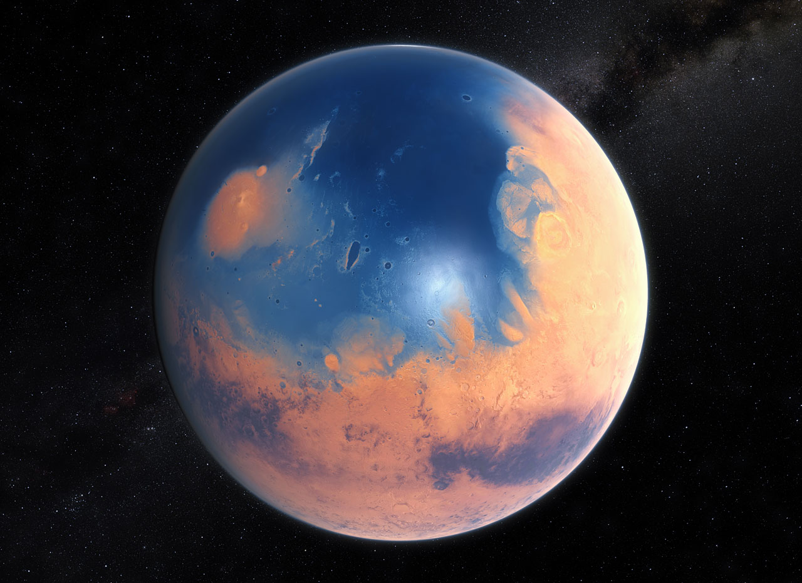

<html lang="fr">
<head>
<meta charset="UTF-8">
<meta name="viewport" content="width=device-width, initial-scale=1.0">
<title>NOVA — Mission Control</title>
<link rel="preconnect" href="https://fonts.googleapis.com">
<link href="https://fonts.googleapis.com/css2?family=Barlow+Condensed:wght@500;600;700&family=Inter:wght@300;400;500;600&family=IBM+Plex+Mono:wght@400;500&display=swap" rel="stylesheet">

</head>

 

<body>

<nav>
  

    
NOVA.

    <button class="menu-toggle" id="menuToggle" aria-label="Ouvrir le menu">☰</button>
    

      <a href="#missions">Missions</a>
      <a href="#programme">Programme</a>
      <a href="#galerie">Galerie</a>
    

    <a aria-label="Rejoindre l’équipe NOVA" class="nav-cta" href="nova-team.html" id="navCta">Rejoindre l'équipe</a>
  

</nav>

<header class="hero">
  

  

    
PROCHAIN LANCEMENT — PAS DE TIR 1

    <h1>Rendre la vie multiplanétaire</h1>
    

      Nous développons les fusées et vaisseaux les plus avancés au monde pour transporter des humains
      vers la Lune, Mars, et au-delà.
    

    

      <a class="btn-primary" href="#missions">Voir les missions</a>
      <a class="btn-secondary" href="#programme">Le programme</a>
    

  

</header>

  

    
MISSION AURORA-3 — DÉCOLLAGE DANS

    

      

--

Jours

      

--

Heures

      

--

Min

      

--

Sec

    

  

<section id="programme" class="reveal">
  

    
Le programme

    <h2>Construire la génération de fusées réutilisables</h2>
    

      

312

Lancements réussis

      

98%

Taux de récupération

      

14

Missions habitées

      

2031

Objectif Mars

    

  

</section>

<section id="missions" class="reveal">
  

    
Calendrier

    <h2>Missions à venir</h2>
    

      

        
01

        
Aurora-3 — Ravitaillement orbital

        
14 OCT 2026

        
GO

      

      

        
02

        
Lunaris — Retour d'équipage

        
02 NOV 2026

        
GO

      

      

        
03

        
Helios — Déploiement satellite

        
19 NOV 2026

        
EN PRÉPARATION

      

      

        
04

        
Terra Nova — Essai vaisseau

        
05 DÉC 2026

        
EN PRÉPARATION

      

    

  

</section>

<section id="galerie" class="reveal">
  

    
Galerie

    <h2>De l'usine au pas de tir</h2>
    

      

  

  

  

  

  

    

  

</section>

<section class="cta-section reveal" id="contact">
  

    
Rejoins-nous

    <h2>L'espace a besoin de bâtisseurs</h2>
    <a class="btn-primary" href="nova-team.html">Voir les postes ouverts</a>
  

</section>

<footer>
  

    © 2026 — NOVA Aerospace
    Pas de tir 1 · Base côtière
  

</footer>

</body>
</html>
